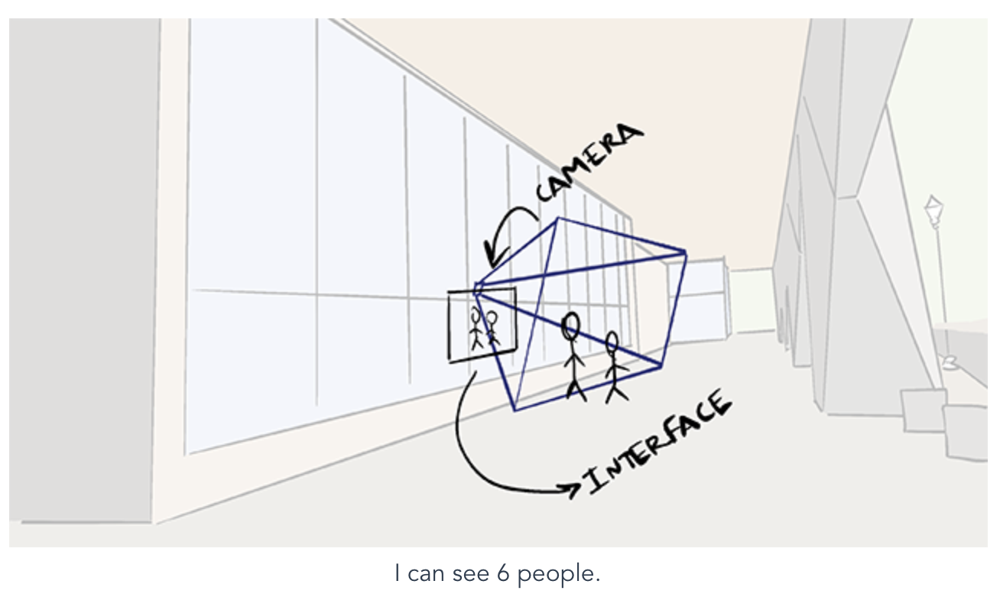

# hci-vue

A simple vue project that subscribes to the `/frames` websocket and prints out the current number of people in view.



Uses a [Vuex](https://vuex.vuejs.org/) store for the global state.

Modify [/src/main.js](/src/main.js) to parse incoming messages and make them available as global state to your app.

## Project setup
```
yarn install
```

### Compiles and hot-reloads for development
```
yarn run serve
```

### Compiles and minifies for production
```
yarn run build
```

### Run your tests
```
yarn run test
```

### Lints and fixes files
```
yarn run lint
```

### Customize configuration
See [Configuration Reference](https://cli.vuejs.org/config/).
